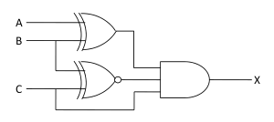
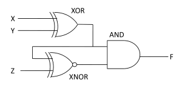

##  Pre Test 
#### Please attempt the following questions

Q1. Which gate is also known as nothing or all gate?  

A     OR gate  
<b>B     AND gate</b>  
C     NAND gate  
D     NOT gate  
 
    

Q2. The output of the two-input NAND gate is high  

A     Only if both the inputs are high  
B     Only if both the inputs are low  
C     Only if one input is high and the other is low  
<b>D     If at least one input is low</b>  
 

Q3. An exclusive NOR gate is logically equal to  

A     Inverter followed by an XOR gate  
B     NOT gate followed by an exclusive XOR gate  
<b>C     Exclusive OR gate followed by an inverter</b>  
D     The complement of a NOR gate  
 

Q4. Maximum number of input lines in practical NOR gate IC is \_\_\_\_\_\_\_.  

<b>A     11</b>  
B     Zero  
C     Infinite  
D     3  
 
  

Q5. Digital circuits can be made by the repeated use of \_\_\_\_\_\_\_\_.  

A     OR gates  
B     NOT gates  
<b>C     NAND gates</b>  
D     None of the above  
 

Q6. The minimum number of NAND gates required to implement the Boolean function A + AB’ + AB’C is equal to  

<b>A     Zero</b>  
B     1  
C     4  
D     7  
 

Q7. The output of the logic gate shown is  
  

A     0  
B     1  
C     A  
<b>D     A’</b>  
 

Q8. For the logic circuit shown in the figure, the required input combination (A,B,C) to make the output X = 1 is  
  

A     1, 0, 1  
B     0, 0, 1  
C     1, 1, 1  
<b>D     0, 1, 1</b>  
 

Q9. The output F in the digital logic circuit shown in the figure is  
  

<b>A     X’YZ + XY’Z</b>  
B     X’YZ’+ XY’Z’  
C     X’Y’Z + XYZ  
D     X’Y’Z’ + XYZ  
 

Q10. \_\_\_\_\_\_\_\_\_ NOT circuits contained in a 7404 IC  

A     4  
B     3  
<b>C     6</b>  
D     2  

 

