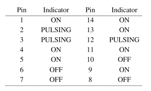
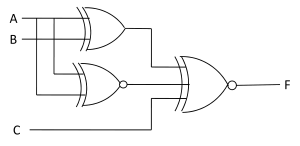
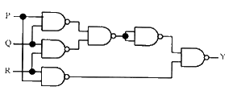

## Post test
#### Please attempt the following questions

Q1. If any two inputs of 3 input ExOR gate are high then output will be \_\_\_\_\_\_\_\_\_\_.  

<b>A  0</b>  
B  1  
C  Either 0 or 1  
D  None of these  
 

Q2. The incorrect input and output lines combination in IC 74266  

A  Input-1,2 Output- 3  
<b>B  Input- 4,5 Output- 6</b>  
C  Input- 8,9 Output- 10  
D  Input- 12,13 Output- 11  
 
  
  
Q3. The 2 input NOR gate output will be high if the inputs are \_\_\_\_\_\_\_\_\_\_.  

<b>A  00</b>  
B  01  
C  10  
D  11  
 
  

Q4. A logic probe is used to test the pins of a 7411 IC with the following results. Is there a problem with the chip and if so, what is the problem?  
  
A  Pin 6 should be ON.  
<b>B  Pin 6 should be pulsing.</b>  
C  Pin 8 should be ON  
D  No problem  
 

Q5. If a 3-input OR gate has eight input possibilities, how many of those possibilities will result in a HIGH output?  

A  1  
B  2  
<b>C  7</b>  
D  8  
 

Q6. To build 4 to 1 multiplexer \_\_\_\_\_\_\_\_\_IC is required.  

A  7432  
B  7404  
C  7408  
<b>D  All of the above</b>  
 

Q7. Match the logic gates in Column A with their equivalents in Column B. 

 
 
A  P – 2, Q – 4, R – 1, S – 3  
B  P – 4, Q – 2, R – 1, S – 3  
C  P – 2, Q – 4, R – 3, S – 1  
<b>D  P – 4, Q – 2, R – 3, S – 1</b>  
 

Q8. For the output F to be 1 in the logic circuit shown, the input combination should be 

A  A = 1, B = 1, C = 0  
B  A = 1, B = 0, C = 0  
C  A = 0, B = 1, C = 0  
<b>D  A = 0, B = 0, C = 1</b>  
 

Q9. The output Y in the circuit below is always ‘1’, when

  

A  Two or more of the inputs P,Q, R are ‘0’  
<b>B  Two or more of the inputs P,Q, R are ‘1’</b>  
C  Any odd number of the inputs P,Q,R is ‘0’  
D  Any odd number of the inputs P,Q,R is ‘1’  
 
  

Q10. In the figure, the LED 

 

A  Emits light when both S1 and S2 are closed.  
B  Emits light when both S1 and S2 are open.  
C  Emits light when only one of S1 or S2 is closed.  
<b>D  Does not emit light, irrespective of the switch positions.</b>  

 

  