## Procedure 

1) Select an IC from the list.  
2) Fill the Truth Table for the IC.  
3) Select any one of the gates of the IC.  
4) Click on the component button to place the component on the table.  
5) Make connections as per the pin diagram of the IC.  
6) Click on check button. If connections are right, verify the truth table.  
7) Select other gate of the IC and repeat steps 4 to 7.  
8) Click on Reset button to reset the page and repeat steps 1 to 8.

### Familiarise with components and connection table of different IC's :

 

**1\. IC-7404(1-INPUT NOT GATE IC)**

  
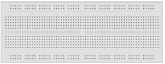&emsp; &emsp; &emsp; &emsp;   

 

**Fig 1: Components for IC-7404(1-INPUT NOT GATE IC)** 

**Connection table for different gates:**

&emsp;&emsp;&emsp;**Table 1: Connection table for Gate 1.** &emsp;&emsp;&emsp;&emsp;&emsp;&emsp;&emsp;&emsp;&emsp;&emsp;  **Table 2: Connection table for Gate 2.** 

&emsp; 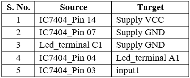

&emsp;&emsp;&emsp;**Table 3: Connection table for Gate 3.** &emsp;&emsp;&emsp;&emsp;&emsp;&emsp;&emsp;&emsp;&emsp;&emsp; **Table 4: Connection table for Gate 4.**

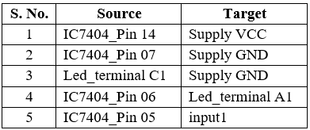&emsp; 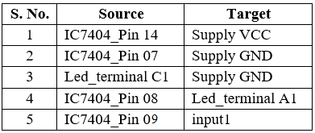

&emsp;&emsp;&emsp;**Table 5: Connection table for Gate 5.** &emsp;&emsp;&emsp;&emsp;&emsp;&emsp;&emsp;&emsp;&emsp;&emsp;**Table 6: Connection table for Gate 6.**

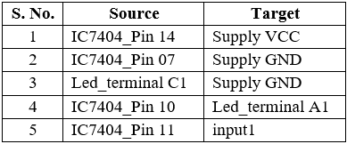&emsp; 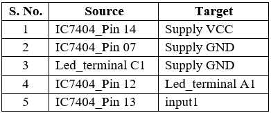   

  

**2\. IC-7432(2-INPUT OR GATE IC)**

&emsp; &emsp; 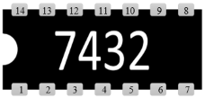&emsp; &emsp; &emsp;   
 
**Fig 2: Components for IC-7432(2-INPUT OR GATE IC)** 

  

**Connection table for different gates:**

&emsp;&emsp;&emsp;**Table 7: Connection table for Gate 1.**&emsp;&emsp;&emsp;&emsp;&emsp;&emsp;&emsp;&emsp;&emsp;&emsp;**Table 8: Connection table for Gate 2.**

&emsp; 

&emsp;&emsp;&emsp;**Table 9: Connection table for Gate 3.**&emsp;&emsp;&emsp;&emsp;&emsp;&emsp;&emsp;&emsp;&emsp;&emsp;**Table 10: Connection table for Gate 4.**

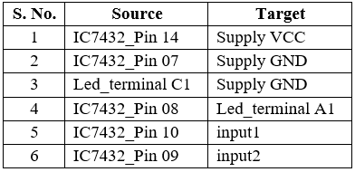 &emsp;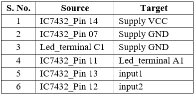   

  
  
**3\. IC-7408(2-INPUT AND GATE IC)**

  
&emsp; &emsp; 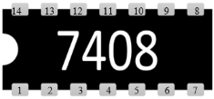&emsp; &emsp; &emsp;   

**Fig 3: Components for IC-7408(2-INPUT AND GATE IC)** 

**Connection table for different gates:**

&emsp;&emsp;&emsp;**Table 11: Connection table for Gate 1.**&emsp;&emsp;&emsp;&emsp;&emsp;&emsp;&emsp;&emsp;&emsp;&emsp; **Table 12: Connection table for Gate 2.**

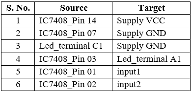&emsp; 

  
&emsp;&emsp;&emsp;**Table 13: Connection table for Gate 3.**&emsp;&emsp;&emsp;&emsp;&emsp;&emsp;&emsp;&emsp;&emsp;&emsp; **Table 14: Connection table for Gate 4.**

 &emsp; 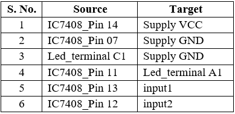  

   

**4\. IC-7400(2-INPUT NAND GATE IC)**

  
&emsp; &emsp; 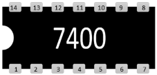&emsp; &emsp; &emsp;   

**Fig 4: Components for IC-7400(2-INPUT NAND GATE IC)** 

**Connection table for different gates:**

&emsp;&emsp;&emsp;**Table 15: Connection table for Gate 1.** &emsp;&emsp;&emsp;&emsp;&emsp;&emsp;&emsp;&emsp;&emsp;&emsp; **Table 16: Connection table for Gate 2.**

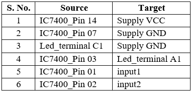&emsp; 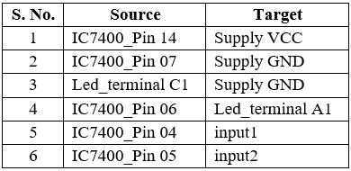

&emsp;&emsp;&emsp;**Table 17: Connection table for Gate 3.** &emsp;&emsp;&emsp;&emsp;&emsp;&emsp;&emsp;&emsp;&emsp;&emsp; **Table 18: Connection table for Gate 4.**

&emsp; 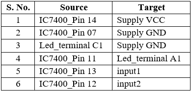  

  

**5\. IC-7402(2-INPUT NOR GATE IC)**

  
&nbsp; &nbsp;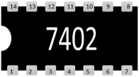&nbsp; &nbsp; &nbsp;   

**Fig 5: Components for IC-7402(2-INPUT NOR GATE IC)** 

**Connection table for different gates:**

&emsp;&emsp;&emsp;**Table 19: Connection table for Gate 1.** &emsp;&emsp;&emsp;&emsp;&emsp;&emsp;&emsp;&emsp;&emsp;&emsp;**Table 20: Connection table for Gate 2.**

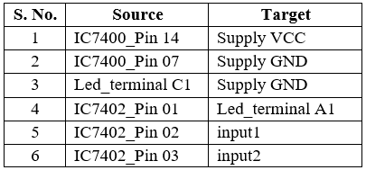&emsp; 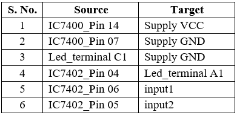
 
&emsp;&emsp;&emsp;**Table 21: Connection table for Gate 3.** &emsp;&emsp;&emsp;&emsp;&emsp;&emsp;&emsp;&emsp;&emsp;&emsp; **Table 22: Connection table for Gate 4.**

&emsp; 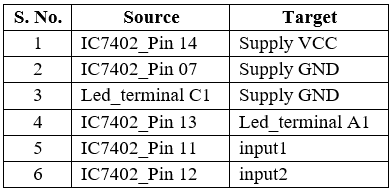 

    

**6\. IC-7486(2-INPUT EX-OR GATE IC)**

  
&emsp; &emsp; &emsp; &emsp; &emsp;   

**Fig 6: Components for IC-7486(2-INPUT EX-OR GATE IC)** 

**Connection table for different gates:**

&emsp;&emsp;&emsp;**Table 23: Connection table for Gate 1.** &emsp;&emsp;&emsp;&emsp;&emsp;&emsp;&emsp;&emsp;&emsp;&emsp; **Table 24: Connection table for Gate 2.**

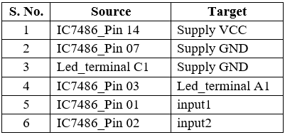&emsp; 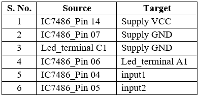

&emsp;&emsp;&emsp;**Table 25: Connection table for Gate 3.** &emsp;&emsp;&emsp;&emsp;&emsp;&emsp;&emsp;&emsp;&emsp;&emsp; **Table 26: Connection table for Gate 4.**

&emsp; 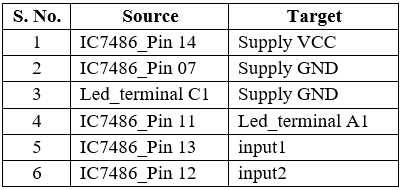  

  

**7\. IC-74266(2-INPUT EX-NOR GATE IC)**

  
&nbsp; &nbsp; 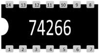&nbsp; &nbsp; &nbsp;   

**Fig 7: Components for IC-74266(2-INPUT EX-NOR GATE IC)** 

**Connection table for different gates:**

&emsp;&emsp;&emsp;**Table 27: Connection table for Gate 1.**&emsp;&emsp;&emsp;&emsp;&emsp;&emsp;&emsp;&emsp;&emsp;&emsp;**Table 28: Connection table for Gate 2.**

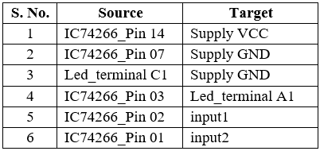&emsp;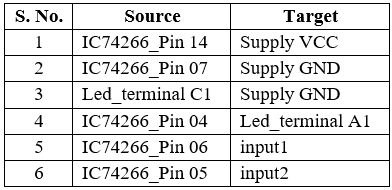

&emsp;&emsp;&emsp;**Table 29: Connection table for Gate 3.**&emsp;&emsp;&emsp;&emsp;&emsp;&emsp;&emsp;&emsp;&emsp;&emsp;**Table 30: Connection table for Gate 4.**

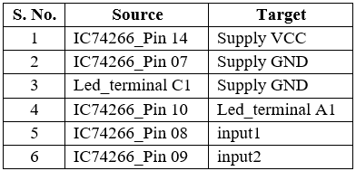&emsp;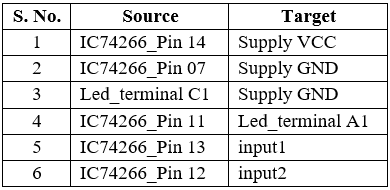 

  

**8\. IC-7411(3-INPUT AND GATE IC)**

  
&nbsp; &nbsp; 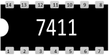&nbsp; &nbsp; &nbsp;   

**Fig 8: Components for IC-7411(3-INPUT AND GATE IC)** 

**Connection table for different gates:**

&emsp;&emsp;&emsp;**Table 31: Connection table for Gate 1.** &emsp;&emsp;&emsp;&emsp;&emsp;&emsp;&emsp;&emsp;&emsp;&emsp;**Table 32: Connection table for Gate 2.**

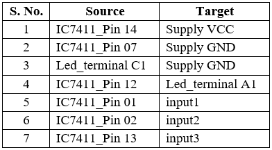 &emsp; 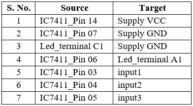 
  
**Table 33: Connection table for Gate 3.**

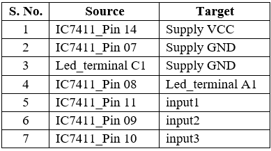    

   

**9\. IC-74HC4075(3-INPUT OR GATE IC)**

  
&emsp; &emsp; 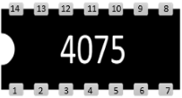&emsp; &emsp; &emsp; &emsp;   

**Fig 9: Components for IC-74HC4075(3-INPUT OR GATE IC)** 

**Connection table for different gates:**

&emsp;&emsp;&emsp;**Table 34: Connection table for Gate 1.** &emsp;&emsp;&emsp;&emsp;&emsp;&emsp;&emsp;&emsp;&emsp;&emsp; **Table 35: Connection table for Gate 2.**

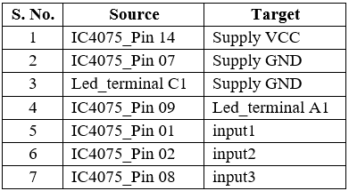&emsp; 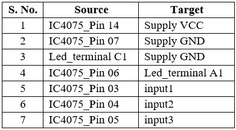 
  
**Table 36: Connection table for Gate 3.**

  

   
  

**10\. IC-7410(3-INPUT NAND GATE IC)**

  
&emsp; &emsp; 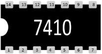&emsp; &emsp; &emsp; &emsp;   
 

**Fig 10: Components for IC-7410(3-INPUT NAND GATE IC)** 

**Connection table for different gates:**

&emsp;&emsp;&emsp;**Table 37: Connection table for Gate 1.**  &emsp;&emsp;&emsp;&emsp;&emsp;&emsp;&emsp;&emsp;&emsp;&emsp; **Table 38: Connection table for Gate 2.**

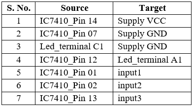&emsp; 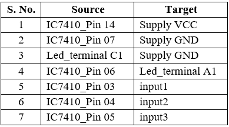

**Table 39: Connection table for Gate 3.**

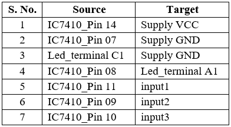  

  
  

**11\. IC-7427(3-INPUT NOR GATE IC)**

  
&emsp; &emsp; 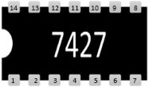&emsp; &emsp; &emsp; &emsp;   

**Fig 11: Components for IC-7427(3-INPUT NOR GATE IC)** 

**Connection table for different gates:**

&emsp;&emsp;&emsp;**Table 40: Connection table for Gate 1.**  &emsp;&emsp;&emsp;&emsp;&emsp;&emsp;&emsp;&emsp;&emsp;&emsp;**Table 41: Connection table for Gate 2.**

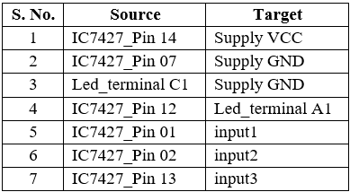&emsp; 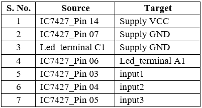

**Table 42: Connection table for Gate 3.**

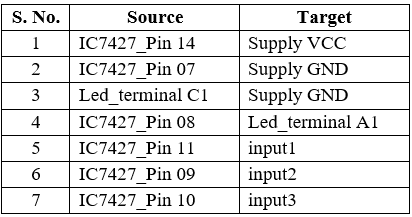  

