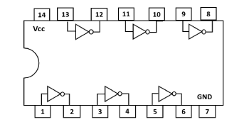
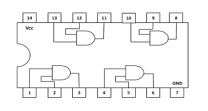
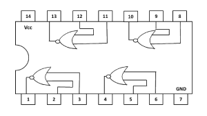
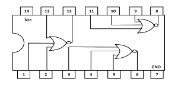

### Introduction

### List of logic gate ICs used in simulation:

• IC-7404 (NOT Gate)  
• IC-7432 (2-Input OR Gate)  
• IC-7408 (2-Input AND Gate)  
• IC-7400 (2-Input NAND Gate)  
• IC-7402 (2-Input NOR Gate)  
• IC-7486 (2-Input EX-OR Gate)  
• IC-74266 (2-Input EX-NOR Gate)  
• IC-7411 (3-Input AND Gate)  
• IC-74HC4075 (3-Input OR Gate)  
• IC-7410 (3-Input NAND Gate)  
• IC-7427 (3-Input NOR Gate)  

### **Theory**

### **Gate**

A gate may be regarded as a barrier which when closed prevents the passage of information but if opened allows the signals to pass through freely.

### **Logic Gate**

Logic gates are the building blocks of digital electronics. They are used in digital electronics to change one voltage level (input voltage) into another (output voltage) according to some logical statement relating them.  
_**‘Thus, logic gate is a digital circuit which works according to some logical relationship between input and output voltages.’**_  
A logic gate may have one or more inputs, but it has only one output.

### **Truth Table**

The relationship between the possible values of input and output voltages are expressed in the form of a table called _**truth table**_ or _**table of combinations.**_  
Truth table of a logic gate is a table that shows all input and output possibilities for the logic gate.

The basic logic gates are:  
• OR gate  
• AND gate  
• NOT gate  
• EX-OR gate  
• EX-NOR gate  

The logical statements that logic gates follow are called Boolean expressions.  
eg: Y = A + B, Y = A.B, Y = A’ are Boolean expressions for the OR, AND and NOT gates respectively.

Logic functions can be implemented in several ways. In the past, vacuum tube and relay circuits performed logic functions. Now a days digital logic gates can be made by connecting discrete components such as diodes, transistors and resistors together but these are less common. Presently logic functions are performed by tiny integrated circuits (ICs). These ICs are small silicon semiconductors sheets called chips, containing the electronic components for the logic gates. The chip is mounted in a plastic container, and connections are welded to external pins which may range from 14 in a small IC package to 64 or more in a large one.

### **INTEGRATED CIRCUITS**

An integrated circuit (Fig-1), abbreviated as IC, is a semiconductor wafer on which thousands or millions of both the active and passive components as resistors, capacitors and transistors are fabricated. The typical size of an IC is 0.2 mm x 0.2 mm x 0.001 mm. The individual circuit components of an IC cannot be removed or replaced because they are automatically part of a single chip. The different components are isolated from each other by isolation diffusion within the crystal chip and are interconnected by an aluminium layer which serves as wires.

 

.png)

**Fig.-1: An integrated circuit**

  
A particular IC is categorized linear (analog) or digital depending on its intended application.Linear ICs have continuously variable output (theoretically capable of attaining an infinite number of states) that depends on the input signal level.Linear ICs are used as audio frequency (AF) and radio frequency (RF) amplifiers.Digital ICs operate at only a few defined levels or states rather than over a continuous range of signal amplitudes. These devices are used in computers, computer networks, modems and frequency counters. The fundamental building blocks of digital ICs are logic gates which work with binary data, i.e., signals that have only two different states called low (logic 0) and high (logic 1).

Basically, there are two types of semiconductor devices: bipolar and unipolar. Based on these devices, digital integrated circuits have been made which are commercially available. Various digital functions are being fabricated in a variety of forms using bipolar and unipolar technologies. A group of compatible IC’s with the same logic levels and supply voltages for performing various logic functions have been fabricated using a specific circuit configuration which is referred to as a logic family.

In1964, Texas instruments introduced transistor-transistor logic, a widely used family of digital devices. TTL is fast, inexpensive, and easy to use. Since TTL uses active low as well as active high signals, negative logic may be used as well as positive logic. Another logic family MOS employs unipolar devices MOSFETs. In PMOS, only p-channel MOSFETs are used and in NMOS, only n-channel MOSFETs are used while in complementary MOS (CMOS), both p- and n-channel MOSFETs are employed in a push-pull arrangement and are fabricated on the same silicon chip. Because the input current of a MOSFET is much smaller than that of a bipolar transistor, cascaded CMOS devices have very low power dissipation compared with TTL devices. This low dissipation explains why CMOS circuits are used in battery powered equipment such as pocket calculators, digital wrist watches, and portable computers.

The most popular transistor-transistor logic (TTL) in use includes the 7400 and the 74LS00 families: resistors, diodes and BJT’s are the elements used to construct these circuits. The 74C00 and the 74HC00 are the most widely used CMOS families. They use two different types of MOSFETs.

7400 TTL series devices are guaranteed to work reliably over a temperature range of 0 to 70°C and over a supply range of 4.75 to 5.25 volts. The NAND gate is the backbone of the 7400 TTL series because most devices in this family are derived from it. Because of its central role in TTL technology, the NAND gate has become the least expensive and most widely used TTL gate. Furthermore, the NAND gate is available in more configurations than other gates, as shown in table below. The NAND gate is available as a 2-, 3-, 4-, or 8-input gate. The other gates have fewer configurations.

  
 

**Table 1: Standard TTL Gates**

<table style="align:center;color:black;margin-left:auto;margin-right:auto;">
<tr>
<th style="border:1px solid black;font-size:120%;border-collapse:collapse;">TYPE</th>
<th style="border:1px solid black;font-size:120%;border-collapse:collapse;">QUAD 2 INPUT</th>
<th style="border:1px solid black;font-size:120%;border-collapse:collapse;">TRIPLE 3 INPUT</th>
<th style="border:1px solid black;font-size:120%;border-collapse:collapse;">DUAL 4 INPUT</th>
<th style="border:1px solid black;font-size:120%;border-collapse:collapse;">SINGLE 8 INPUT</th>
</tr>

<tr>
<td style="border:1px solid black;font-size:130%;border-collapse:collapse;">NAND</td>
<td style="border:1px solid black;font-size:130%;border-collapse:collapse;">7400</td>
<td style="border:1px solid black;font-size:130%;border-collapse:collapse;">7410</td>
<td style="border:1px solid black;font-size:130%;border-collapse:collapse;">7420</td>
<td style="border:1px solid black;font-size:130%;border-collapse:collapse;">7430</td>
</tr>

<tr>
<td style="border:1px solid black;font-size:130%;border-collapse:collapse;">NOR</td>
<td style="border:1px solid black;font-size:130%;border-collapse:collapse;">7402</td>
<td style="border:1px solid black;font-size:130%;border-collapse:collapse;">7427</td>
<td style="border:1px solid black;font-size:130%;border-collapse:collapse;">7425</td>
<td style="border:1px solid black;font-size:130%;border-collapse:collapse;"></td>
</tr>

<tr>
<td style="border:1px solid black;font-size:130%;border-collapse:collapse;">AND</td>
<td style="border:1px solid black;font-size:130%;border-collapse:collapse;">7408</td>
<td style="border:1px solid black;font-size:130%;border-collapse:collapse;">7411</td>
<td style="border:1px solid black;font-size:130%;border-collapse:collapse;">7421</td>
<td style="border:1px solid black;font-size:130%;border-collapse:collapse;"></td>
</tr>

<tr>
<td style="border:1px solid black;font-size:130%;border-collapse:collapse;">OR</td>
<td style="border:1px solid black;font-size:130%;border-collapse:collapse;">7432</td>
<td style="border:1px solid black;font-size:130%;border-collapse:collapse;"></td>
<td style="border:1px solid black;font-size:130%;border-collapse:collapse;"></td>
<td style="border:1px solid black;font-size:130%;border-collapse:collapse;"></td>
</tr>
</table>

### **BASIC LOGIC GATES:**

### 1\. NOT GATE

A NOT gate is also known as an _**inverter.**_ It has one input A and one output Y. _**The output Y of NOT gate is always complement of input A.**_  
In equation form,  

 

**Y = NOT A = A’ i.e. Y = A’**

so that, if A = 0, Y = 0’ = 1  
and if A = 1, Y = 1’= 0.  
Fig-2 shows the symbol of NOT gate.

 

**Fig.-2: Symbol of NOT gate**
 
**Table 2:Truth table for NOT gate**

<table align="center" style="text-align:center;color:black;">
  <tr>
    <th style="border:1px solid black;font-size:120%;border-collapse:collapse;">INPUT A</th>
    <th style="border:1px solid black;font-size:120%;border-collapse:collapse;">OUTPUT Y = A'</th>
    </tr>
    <tr>
    <td style="border:1px solid black;font-size:130%;border-collapse:collapse;">0</td>
    <td style="border:1px solid black;font-size:130%;border-collapse:collapse;">1</td>
    </tr>   
    <tr>
    <td style="border:1px solid black;font-size:130%;border-collapse:collapse;">1</td>
    <td style="border:1px solid black;font-size:130%;border-collapse:collapse;">0</td>
    </tr>
    </table>
 

The presence of a small circle, known as the bubble, always denotes inversion in digital circuits.

IC- 7404 is standard TTL IC of NOT gate.

### NOT GATE IC-7404

IC-7404 (Fig-3) contains six independent gates each of which performs the logic INVERT function. The operating voltage is 5 V, high level input voltage is 2 V, and low level input is 0.8 V

  

**Fig.-3: Pin diagram of NOT gate IC 7404**

### 2\. AND GATE

The AND gate has two or more input signals but only one output signal. The AND gate has a high output when all inputs are high. In other words, the AND gate is an **_‘all or nothing gate’_**; a high output occurs only when all inputs are high.  
In Boolean equation form -  

 

**Y = A AND B = A.B**  

The symbol ‘.’ in the above expression is known as the ‘AND operator’. The 2-input AND gate symbol is shown in Fig-4.

 

**Fig.-4: Symbol of 2-input AND gate**  

**Table 3:Truth table for 2-input AND gate**

<table style="text-align:center;color:black;">  
      <tr style="border:1px solid black;font-size:130%;border-collapse:collapse;">
      <th colspan="2"; style="border:1px solid black;border-collapse:collapse;">INPUT</th>
      <th style="border:1px solid black;border-collapse:collapse;" >OUTPUT</th>
      </tr>
      <tr>
      <th style="border:1px solid black;font-size:120%;border-collapse:collapse;">A</th>
      <th style="border:1px solid black;font-size:120%;border-collapse:collapse;">B</th>
      <th style="border:1px solid black;font-size:120%;border-collapse:collapse;">Y = A.B</th>
      </tr>
      <tr>
      <td style="border:1px solid black;font-size:130%;border-collapse:collapse;">0</td>
      <td style="border:1px solid black;font-size:130%;border-collapse:collapse;">0</td>
      <td style="border:1px solid black;font-size:130%;border-collapse:collapse;">0</td>
      </tr>
    <tr>
      <td style="border:1px solid black;font-size:130%;border-collapse:collapse;">0</td>
      <td style="border:1px solid black;font-size:130%;border-collapse:collapse;">1</td>
      <td style="border:1px solid black;font-size:130%;border-collapse:collapse;">0</td>
      </tr>
      <tr>
      <td style="border:1px solid black;font-size:130%;border-collapse:collapse;">1</td>
      <td style="border:1px solid black;font-size:130%;border-collapse:collapse;">0</td>
      <td style="border:1px solid black;font-size:130%;border-collapse:collapse;">0</td>
      </tr>
      <tr>
      <td style="border:1px solid black;font-size:130%;border-collapse:collapse;">1</td>
      <td style="border:1px solid black;font-size:130%;border-collapse:collapse;">1</td>
      <td style="border:1px solid black;font-size:130%;border-collapse:collapse;">1</td>
      </tr> 
      </table>
   
      

  

**The AND gate has a high output only when A and B are high.**

An AND gate can have as many inputs as desired.  
Fig-5 shows the symbol of a 3-input AND gate. The inputs are A, B and C. When all inputs are low, Y is low. Even if one input is low, Y is in the low state. The only way to get a high output is to raise all inputs to high state (+5 V). In equation form, the 3-input AND gate is represented as:

 

**Y = A.B.C**

**Fig.-5: Symbol of 3-input AND gate** 

**Table 4:Truth table for 3-input AND gate**

    <table style="text-align:center;color:black;">
      <tr style="border:1px solid black;font-size:130%;border-collapse:collapse;">
      <th colspan="3"; style="border:1px solid black;border-collapse:collapse;">INPUT</th>
      <th style="border:1px solid black;border-collapse:collapse;" >OUTPUT</th>
      </tr>      
      <tr>
      <th style="border:1px solid black;font-size:120%;border-collapse:collapse;">A</th>
      <th style="border:1px solid black;font-size:120%;border-collapse:collapse;">B</th>
      <th style="border:1px solid black;font-size:120%;border-collapse:collapse;">C</th>
      <th style="border:1px solid black;font-size:120%;border-collapse:collapse;">Y = A.B.C</th>
      </tr>      
      <tr>
      <td style="border:1px solid black;font-size:130%;border-collapse:collapse;">0</td>
      <td style="border:1px solid black;font-size:130%;border-collapse:collapse;">0</td>
      <td style="border:1px solid black;font-size:130%;border-collapse:collapse;">0</td>
      <td style="border:1px solid black;font-size:130%;border-collapse:collapse;">0</td>
      </tr>     
      <tr>
      <td style="border:1px solid black;font-size:130%;border-collapse:collapse;">0</td>
      <td style="border:1px solid black;font-size:130%;border-collapse:collapse;">0</td>
      <td style="border:1px solid black;font-size:130%;border-collapse:collapse;">1</td>
      <td style="border:1px solid black;font-size:130%;border-collapse:collapse;">0</td>
      </tr>      
      <tr>
      <td style="border:1px solid black;font-size:130%;border-collapse:collapse;">0</td>
      <td style="border:1px solid black;font-size:130%;border-collapse:collapse;">1</td>
      <td style="border:1px solid black;font-size:130%;border-collapse:collapse;">0</td>
      <td style="border:1px solid black;font-size:130%;border-collapse:collapse;">0</td>
      </tr>      
      <tr>
      <td style="border:1px solid black;font-size:130%;border-collapse:collapse;">0</td>
      <td style="border:1px solid black;font-size:130%;border-collapse:collapse;">1</td>
      <td style="border:1px solid black;font-size:130%;border-collapse:collapse;">1</td>
      <td style="border:1px solid black;font-size:130%;border-collapse:collapse;">0</td>
      </tr>      
      <tr>
      <td style="border:1px solid black;font-size:130%;border-collapse:collapse;">1</td>
      <td style="border:1px solid black;font-size:130%;border-collapse:collapse;">0</td>
      <td style="border:1px solid black;font-size:130%;border-collapse:collapse;">0</td>
      <td style="border:1px solid black;font-size:130%;border-collapse:collapse;">0</td>
      </tr>      
      <tr>
      <td style="border:1px solid black;font-size:130%;border-collapse:collapse;">1</td>
      <td style="border:1px solid black;font-size:130%;border-collapse:collapse;">0</td>
      <td style="border:1px solid black;font-size:130%;border-collapse:collapse;">1</td>
      <td style="border:1px solid black;font-size:130%;border-collapse:collapse;">0</td>
      </tr>     
      <tr>
      <td style="border:1px solid black;font-size:130%;border-collapse:collapse;">1</td>
      <td style="border:1px solid black;font-size:130%;border-collapse:collapse;">1</td>
      <td style="border:1px solid black;font-size:130%;border-collapse:collapse;">0</td>
      <td style="border:1px solid black;font-size:130%;border-collapse:collapse;">0</td>
      </tr>      
      <tr>
      <td style="border:1px solid black;font-size:130%;border-collapse:collapse;">1</td>
      <td style="border:1px solid black;font-size:130%;border-collapse:collapse;">1</td>
      <td style="border:1px solid black;font-size:130%;border-collapse:collapse;">1</td>
      <td style="border:1px solid black;font-size:130%;border-collapse:collapse;">1</td>
      </tr>      
      </table>
   

IC 7408 and IC 7411 are standard TTL ICs of 2 input and 3input AND gate respectively

### 2-INPUT AND GATE IC-7408

IC-7408 (Fig-6) is a Quad 2-input AND gates and contains four independent gates each of which performs the logic AND function.

### 3-INPUT AND GATE IC-7411

IC-7411 (Fig-7) is a Triple 3-input AND gate and contains three independent gates each of which perform logic AND operation.

 

 &emsp;&emsp;&emsp;&emsp;&emsp;   

**Fig.-6: Pin diagram of 2-input AND gate IC 7408** &emsp;&emsp; **Fig.-7: Pin diagram of 3-input AND gate IC 7411** 

  

### 3\. OR GATE

The OR gate has two or more input signals but only one output signal. It is called an OR gate because the output voltage is high if any or all of the input voltages are high. For instance, the output of a 2-input OR gate is high if either or both inputs are high. Thus, OR gate is also called **_‘any or all gate’._**  
In Boolean equation form -

  

**Y = A OR B = A + B**

The symbol ‘+’ in the above expression is known as the ‘OR operator’. The 2-input OR gate symbol is shown in Fig-8.

**Fig.-8: Symbol of 2-input OR gate**
  
**Table 5:Truth table for 2-input OR gate**

    <table style="text-align:center;color:black;">    
      <tr style="border:1px solid black;font-size:130%;border-collapse:collapse;">
      <th colspan="2"; style="border:1px solid black;border-collapse:collapse;">INPUT</th>
      <th style="border:1px solid black;border-collapse:collapse;" >OUTPUT</th>
      </tr>     
      <tr>
      <th style="border:1px solid black;font-size:120%;border-collapse:collapse;">A</th>
      <th style="border:1px solid black;font-size:120%;border-collapse:collapse;">B</th>
      <th style="border:1px solid black;font-size:120%;border-collapse:collapse;">Y = A+B</th>
      </tr>      
      <tr>
      <td style="border:1px solid black;font-size:130%;border-collapse:collapse;">0</td>
      <td style="border:1px solid black;font-size:130%;border-collapse:collapse;">0</td>
      <td style="border:1px solid black;font-size:130%;border-collapse:collapse;">0</td>
      </tr>      
      <tr>
      <td style="border:1px solid black;font-size:130%;border-collapse:collapse;">0</td>
      <td style="border:1px solid black;font-size:130%;border-collapse:collapse;">1</td>
      <td style="border:1px solid black;font-size:130%;border-collapse:collapse;">1</td>
      </tr>      
      <tr>
      <td style="border:1px solid black;font-size:130%;border-collapse:collapse;">1</td>
      <td style="border:1px solid black;font-size:130%;border-collapse:collapse;">0</td>
      <td style="border:1px solid black;font-size:130%;border-collapse:collapse;">1</td>
      </tr>      
      <tr>
      <td style="border:1px solid black;font-size:130%;border-collapse:collapse;">1</td>
      <td style="border:1px solid black;font-size:130%;border-collapse:collapse;">1</td>
      <td style="border:1px solid black;font-size:130%;border-collapse:collapse;">1</td>
      </tr>      
      </table>
   
  

  

An OR gate can have as many inputs as desired. No matter how many inputs, the action of any OR gate is summarized like this:  
**One or more high inputs produce a high output.**  
The logic symbol of a three input OR gate is shown in Fig-9.

**Fig.-9: Symbol of 3-input OR gate**

**Table 6:Truth table for 3-input OR gate**

    <table style="text-align:center;color:black;">    
      <tr style="border:1px solid black;font-size:130%;border-collapse:collapse;">
      <th colspan="3"; style="border:1px solid black;border-collapse:collapse;">INPUT</th>
      <th style="border:1px solid black;border-collapse:collapse;" >OUTPUT</th>
      </tr>     
      <tr>
      <th style="border:1px solid black;font-size:120%;border-collapse:collapse;">A</th>
      <th style="border:1px solid black;font-size:120%;border-collapse:collapse;">B</th>
      <th style="border:1px solid black;font-size:120%;border-collapse:collapse;">C</th>
      <th style="border:1px solid black;font-size:120%;border-collapse:collapse;">Y = A+B+C</th>
      </tr>      
      <tr>
      <td style="border:1px solid black;font-size:130%;border-collapse:collapse;">0</td>
      <td style="border:1px solid black;font-size:130%;border-collapse:collapse;">0</td>
      <td style="border:1px solid black;font-size:130%;border-collapse:collapse;">0</td>
      <td style="border:1px solid black;font-size:130%;border-collapse:collapse;">0</td>
      </tr>     
      <tr>
      <td style="border:1px solid black;font-size:130%;border-collapse:collapse;">0</td>
      <td style="border:1px solid black;font-size:130%;border-collapse:collapse;">0</td>
      <td style="border:1px solid black;font-size:130%;border-collapse:collapse;">1</td>
      <td style="border:1px solid black;font-size:130%;border-collapse:collapse;">1</td>
      </tr>      
      <tr>
      <td style="border:1px solid black;font-size:130%;border-collapse:collapse;">0</td>
      <td style="border:1px solid black;font-size:130%;border-collapse:collapse;">1</td>
      <td style="border:1px solid black;font-size:130%;border-collapse:collapse;">0</td>
      <td style="border:1px solid black;font-size:130%;border-collapse:collapse;">1</td>
      </tr>      
      <tr>
      <td style="border:1px solid black;font-size:130%;border-collapse:collapse;">0</td>
      <td style="border:1px solid black;font-size:130%;border-collapse:collapse;">1</td>
      <td style="border:1px solid black;font-size:130%;border-collapse:collapse;">1</td>
      <td style="border:1px solid black;font-size:130%;border-collapse:collapse;">1</td>
      </tr>    
      <tr>
      <td style="border:1px solid black;font-size:130%;border-collapse:collapse;">1</td>
      <td style="border:1px solid black;font-size:130%;border-collapse:collapse;">0</td>
      <td style="border:1px solid black;font-size:130%;border-collapse:collapse;">0</td>
      <td style="border:1px solid black;font-size:130%;border-collapse:collapse;">1</td>
      </tr>      
      <tr>
      <td style="border:1px solid black;font-size:130%;border-collapse:collapse;">1</td>
      <td style="border:1px solid black;font-size:130%;border-collapse:collapse;">0</td>
      <td style="border:1px solid black;font-size:130%;border-collapse:collapse;">1</td>
      <td style="border:1px solid black;font-size:130%;border-collapse:collapse;">1</td>
      </tr>      
      <tr>
      <td style="border:1px solid black;font-size:130%;border-collapse:collapse;">1</td>
      <td style="border:1px solid black;font-size:130%;border-collapse:collapse;">1</td>
      <td style="border:1px solid black;font-size:130%;border-collapse:collapse;">0</td>
      <td style="border:1px solid black;font-size:130%;border-collapse:collapse;">1</td>
      </tr>      
      <tr>
      <td style="border:1px solid black;font-size:130%;border-collapse:collapse;">1</td>
      <td style="border:1px solid black;font-size:130%;border-collapse:collapse;">1</td>
      <td style="border:1px solid black;font-size:130%;border-collapse:collapse;">1</td>
      <td style="border:1px solid black;font-size:130%;border-collapse:collapse;">1</td>
      </tr>      
      </table>
   
                       

  

IC 7432 and IC 744075 are standard TTL IC of 2 input and 3input OR gate respectively

### 2-INPUT OR GATE IC-7432

IC-7432 (Fig-10) is a device that contains four independent 2-input OR gates. Each of these gates perform the logic OR operation.

### 3-INPUT OR GATE IC-74HC/HCT4075

IC-74HC/HCT4075(Fig-11) is a Triple 3-inputOR gate and contains three independent gates each of which perform logic OR operation

 

 &emsp;&emsp;&emsp;&emsp;&emsp;

**Fig.-10: Pin diagram of 2-input OR gate IC7432**  &emsp;&emsp; **Fig.-11: Pin diagram of 3-input OR gate IC 74HC/HCT4075**

  

### **UNIVERSAL LOGIC GATES**

AND, OR and NOT gates can be connected together to realize any logic function. It is possible to use only one type of gate for this purpose so that one needs to procure only one type of gate for this design. And more importantly, fabrication of Integrated Circuit that performs a logic operation becomes easier when gate of only one kind is used. Gates, which can perform this task, are called Universal logic gates. Clearly, basic gates like AND, OR and NOT don’t fit into this category for the simple reason that conversion among themselves itself are not possible. As for example, one cannot get OR operation by using any number or combination of AND gates.

### 1\. NAND GATE

It is a logic circuit in which AND gate is followed by a NOT gate. The output of NAND gate is high if any of the inputs are low. Its symbol is an AND gate with a small circle on the output. Fig-12 shows the symbol of 2-input NAND gate. The small circle represents inversion. Boolean expression for NAND gate is as follows:

 

**Y = (A.B)’**

**Fig.-12: Symbol of 2-input NAND gate**

**Table 7:Truth table for 2-input NAND gate**

<table style="text-align:center;color:black;">
<tr style="border:1px solid black;font-size:130%;border-collapse:collapse;">
<th colspan="2"; style="border:1px solid black;border-collapse:collapse;">INPUT</th>
<th style="border:1px solid black;border-collapse:collapse;" >OUTPUT</th>
</tr>

<tr>
<th style="border:1px solid black;font-size:120%;border-collapse:collapse;">A</th>
<th style="border:1px solid black;font-size:120%;border-collapse:collapse;">B</th>
<th style="border:1px solid black;font-size:120%;border-collapse:collapse;">Y = (A.B)'</th>
</tr>

<tr>
<td style="border:1px solid black;font-size:130%;border-collapse:collapse;">0</td>
<td style="border:1px solid black;font-size:130%;border-collapse:collapse;">0</td>
<td style="border:1px solid black;font-size:130%;border-collapse:collapse;">1</td>
</tr>

<tr>
<td style="border:1px solid black;font-size:130%;border-collapse:collapse;">0</td>
<td style="border:1px solid black;font-size:130%;border-collapse:collapse;">1</td>
<td style="border:1px solid black;font-size:130%;border-collapse:collapse;">1</td>
</tr>

<tr>
<td style="border:1px solid black;font-size:130%;border-collapse:collapse;">1</td>
<td style="border:1px solid black;font-size:130%;border-collapse:collapse;">0</td>
<td style="border:1px solid black;font-size:130%;border-collapse:collapse;">1</td>
</tr>

<tr>
<td style="border:1px solid black;font-size:130%;border-collapse:collapse;">1</td>
<td style="border:1px solid black;font-size:130%;border-collapse:collapse;">1</td>
<td style="border:1px solid black;font-size:130%;border-collapse:collapse;">0</td>
</tr>

</table>

  

An NAND gate can have as many inputs as desired. No matter how many inputs, the action of any NAND gate is summarized like this:  
**All high inputs produce a low output.**  
The logic symbol of a three input NAND gate is shown in Fig-13.

 

**Fig.-13: Symbol of 3-input NAND gate**

**Table 8: Truth table for 3-input NAND gate**

<table style="text-align:center;color:black;">
<tr style="border:1px solid black;font-size:130%;border-collapse:collapse;">
<th colspan="3"; style="border:1px solid black;border-collapse:collapse;">INPUT</th>
<th style="border:1px solid black;border-collapse:collapse;" >OUTPUT</th>
</tr>

<tr>
<th style="border:1px solid black;font-size:120%;border-collapse:collapse;">A</th>
<th style="border:1px solid black;font-size:120%;border-collapse:collapse;">B</th>
<th style="border:1px solid black;font-size:120%;border-collapse:collapse;">C</th>
<th style="border:1px solid black;font-size:120%;border-collapse:collapse;">Y = (A.B.C)'</th>
</tr>

<tr>
<td style="border:1px solid black;font-size:130%;border-collapse:collapse;">0</td>
<td style="border:1px solid black;font-size:130%;border-collapse:collapse;">0</td>
<td style="border:1px solid black;font-size:130%;border-collapse:collapse;">0</td>
<td style="border:1px solid black;font-size:130%;border-collapse:collapse;">1</td>
</tr>

<tr>
<td style="border:1px solid black;font-size:130%;border-collapse:collapse;">0</td>
<td style="border:1px solid black;font-size:130%;border-collapse:collapse;">0</td>
<td style="border:1px solid black;font-size:130%;border-collapse:collapse;">1</td>
<td style="border:1px solid black;font-size:130%;border-collapse:collapse;">1</td>
</tr>

<tr>
<td style="border:1px solid black;font-size:130%;border-collapse:collapse;">0</td>
<td style="border:1px solid black;font-size:130%;border-collapse:collapse;">1</td>
<td style="border:1px solid black;font-size:130%;border-collapse:collapse;">0</td>
<td style="border:1px solid black;font-size:130%;border-collapse:collapse;">1</td>
</tr>

<tr>
<td style="border:1px solid black;font-size:130%;border-collapse:collapse;">0</td>
<td style="border:1px solid black;font-size:130%;border-collapse:collapse;">1</td>
<td style="border:1px solid black;font-size:130%;border-collapse:collapse;">1</td>
<td style="border:1px solid black;font-size:130%;border-collapse:collapse;">1</td>
</tr>

<tr>
<td style="border:1px solid black;font-size:130%;border-collapse:collapse;">1</td>
<td style="border:1px solid black;font-size:130%;border-collapse:collapse;">0</td>
<td style="border:1px solid black;font-size:130%;border-collapse:collapse;">0</td>
<td style="border:1px solid black;font-size:130%;border-collapse:collapse;">1</td>
</tr>

<tr>
<td style="border:1px solid black;font-size:130%;border-collapse:collapse;">1</td>
<td style="border:1px solid black;font-size:130%;border-collapse:collapse;">0</td>
<td style="border:1px solid black;font-size:130%;border-collapse:collapse;">1</td>
<td style="border:1px solid black;font-size:130%;border-collapse:collapse;">1</td>
</tr>

<tr>
<td style="border:1px solid black;font-size:130%;border-collapse:collapse;">1</td>
<td style="border:1px solid black;font-size:130%;border-collapse:collapse;">1</td>
<td style="border:1px solid black;font-size:130%;border-collapse:collapse;">0</td>
<td style="border:1px solid black;font-size:130%;border-collapse:collapse;">1</td>
</tr>

<tr>
<td style="border:1px solid black;font-size:130%;border-collapse:collapse;">1</td>
<td style="border:1px solid black;font-size:130%;border-collapse:collapse;">1</td>
<td style="border:1px solid black;font-size:130%;border-collapse:collapse;">1</td>
<td style="border:1px solid black;font-size:130%;border-collapse:collapse;">0</td>
</tr>

</table>

  

IC 7400 and IC 7410 are standard TTL ICs of 2 input and 3input NAND gate respectively

### 2-INPUT NAND GATE IC-7400

IC-7400(Fig-14) designates a device containing four input NAND gates. Each gate uses two pins for input and one pin for its output, and the remaining two contacts are connected to supply power (+5 V) and the ground.

### 3-INPUT NAND GATE IC-7410

IC-7410 (Fig-15) is a Triple 3-input NAND gate and contains three independent gates each of which performs logic NAND operation

 

 &emsp;&emsp;&emsp;&emsp;&emsp; 

**Fig.-14: Pin diagram of 2-input NAND gate IC 7400** &emsp;&emsp; **Fig.-15: Pin diagram of 3-input NAND gate IC 7410**

 
 

### UNIVERSALITY OF NAND GATE

All basic logic gates can be obtained from NAND gates and that is why it is called a universal logic gate.

Fig-16(a) shows how we tie inputs of NAND gate together to get a NOT gate that has only One input. If input is 0, then both the inputs to NAND gate are 0. Following NAND gate truth table, we see output now is 1. Similarly, if input is 1, both the inputs to NAND gate are 1 that gives output 0. Therefore, output of circuit is complement of its input and thus gives NOT operation.

Fig-16(b) shows how we get AND circuit using only NAND gates. The second NAND gate performs as a NOT gate and inverts the NAND logic of first NAND gate to AND logic.

To obtain OR logic using NAND gate, we draw circuit diagram as shown in Fig-16(c). This circuit has NAND gate at output and thus, inverts the output of previous circuit, from NOR to OR.

 

.png)

**Fig.-16(a): NOT gate using NAND gate**

.png)

**Fig.-16(b): AND gate using NAND gate**

.png)

**Fig.-16(c): OR gate using NAND gate**

 
 

### 2\. NOR GATE

It is a logic circuit in which OR gate is followed by a NOT gate. The output of NOR gate is LOW if any of the inputs are HIGH. Its symbol is an OR gate with a small circle on the output (Fig-17). The small circle represents inversion. Boolean expression for NOR gate is as follows:

 

**Y = (A + B)’**

**Fig.-17: Symbol of 2-input NOR gate**

**Table 9: Truth table for 2-input NOR gate**

<table style="text-align:center;color:black;">
<tr style="border:1px solid black;font-size:130%;border-collapse:collapse;">
<th colspan="2"; style="border:1px solid black;border-collapse:collapse;">INPUT</th>
<th style="border:1px solid black;border-collapse:collapse;" >OUTPUT</th>
</tr>

<tr>
<th style="border:1px solid black;font-size:120%;border-collapse:collapse;">A</th>
<th style="border:1px solid black;font-size:120%;border-collapse:collapse;">B</th>
<th style="border:1px solid black;font-size:120%;border-collapse:collapse;">Y = (A+B)'</th>
</tr>

<tr>
<td style="border:1px solid black;font-size:130%;border-collapse:collapse;">0</td>
<td style="border:1px solid black;font-size:130%;border-collapse:collapse;">0</td>
<td style="border:1px solid black;font-size:130%;border-collapse:collapse;">1</td>
</tr>

<tr>
<td style="border:1px solid black;font-size:130%;border-collapse:collapse;">0</td>
<td style="border:1px solid black;font-size:130%;border-collapse:collapse;">1</td>
<td style="border:1px solid black;font-size:130%;border-collapse:collapse;">0</td>
</tr>

<tr>
<td style="border:1px solid black;font-size:130%;border-collapse:collapse;">1</td>
<td style="border:1px solid black;font-size:130%;border-collapse:collapse;">0</td>
<td style="border:1px solid black;font-size:130%;border-collapse:collapse;">0</td>
</tr>

<tr>
<td style="border:1px solid black;font-size:130%;border-collapse:collapse;">1</td>
<td style="border:1px solid black;font-size:130%;border-collapse:collapse;">1</td>
<td style="border:1px solid black;font-size:130%;border-collapse:collapse;">0</td>
</tr>

</table>

  

An NOR gate can have as many inputs as desired. No matter how many inputs, the action of any NOR gate is summarized like this:  
**All low inputs produce a high output.**  
The logic symbol of a three inputs NOR gate is shown in Fig-18.

 

**Fig.-18: Symbol of 3-input NOR gate**

**Table 10: Truth table for 3-input NOR gate**

<table style="text-align:center;color:black;">
<tr style="border:1px solid black;font-size:130%;border-collapse:collapse;">
<th colspan="3"; style="border:1px solid black;border-collapse:collapse;">INPUT</th>
<th style="border:1px solid black;border-collapse:collapse;" >OUTPUT</th>
</tr>

<tr>
<th style="border:1px solid black;font-size:120%;border-collapse:collapse;">A</th>
<th style="border:1px solid black;font-size:120%;border-collapse:collapse;">B</th>
<th style="border:1px solid black;font-size:120%;border-collapse:collapse;">C</th>
<th style="border:1px solid black;font-size:120%;border-collapse:collapse;">Y = (A+B+C)'</th>
</tr>

<tr>
<td style="border:1px solid black;font-size:130%;border-collapse:collapse;">0</td>
<td style="border:1px solid black;font-size:130%;border-collapse:collapse;">0</td>
<td style="border:1px solid black;font-size:130%;border-collapse:collapse;">0</td>
<td style="border:1px solid black;font-size:130%;border-collapse:collapse;">1</td>
</tr>

<tr>
<td style="border:1px solid black;font-size:130%;border-collapse:collapse;">0</td>
<td style="border:1px solid black;font-size:130%;border-collapse:collapse;">0</td>
<td style="border:1px solid black;font-size:130%;border-collapse:collapse;">1</td>
<td style="border:1px solid black;font-size:130%;border-collapse:collapse;">0</td>
</tr>

<tr>
<td style="border:1px solid black;font-size:130%;border-collapse:collapse;">0</td>
<td style="border:1px solid black;font-size:130%;border-collapse:collapse;">1</td>
<td style="border:1px solid black;font-size:130%;border-collapse:collapse;">0</td>
<td style="border:1px solid black;font-size:130%;border-collapse:collapse;">0</td>
</tr>

<tr>
<td style="border:1px solid black;font-size:130%;border-collapse:collapse;">0</td>
<td style="border:1px solid black;font-size:130%;border-collapse:collapse;">1</td>
<td style="border:1px solid black;font-size:130%;border-collapse:collapse;">1</td>
<td style="border:1px solid black;font-size:130%;border-collapse:collapse;">0</td>
</tr>

<tr>
<td style="border:1px solid black;font-size:130%;border-collapse:collapse;">1</td>
<td style="border:1px solid black;font-size:130%;border-collapse:collapse;">0</td>
<td style="border:1px solid black;font-size:130%;border-collapse:collapse;">0</td>
<td style="border:1px solid black;font-size:130%;border-collapse:collapse;">0</td>
</tr>

<tr>
<td style="border:1px solid black;font-size:130%;border-collapse:collapse;">1</td>
<td style="border:1px solid black;font-size:130%;border-collapse:collapse;">0</td>
<td style="border:1px solid black;font-size:130%;border-collapse:collapse;">1</td>
<td style="border:1px solid black;font-size:130%;border-collapse:collapse;">0</td>
</tr>

<tr>
<td style="border:1px solid black;font-size:130%;border-collapse:collapse;">1</td>
<td style="border:1px solid black;font-size:130%;border-collapse:collapse;">1</td>
<td style="border:1px solid black;font-size:130%;border-collapse:collapse;">0</td>
<td style="border:1px solid black;font-size:130%;border-collapse:collapse;">0</td>
</tr>

<tr>
<td style="border:1px solid black;font-size:130%;border-collapse:collapse;">1</td>
<td style="border:1px solid black;font-size:130%;border-collapse:collapse;">1</td>
<td style="border:1px solid black;font-size:130%;border-collapse:collapse;">1</td>
<td style="border:1px solid black;font-size:130%;border-collapse:collapse;">0</td>
</tr>

</table>

 
 

IC 7402 and IC 7427 are standard TTL ICs of 2 input and 3input NOR gate respectively

### 2-INPUT NOR GATE IC-7402

IC-7402 (Fig-19) is a device containing four independent gates each of which performs the logic NOR function. Pins 14 and 7 provide power for all four logic gates.

### 3-INPUT NOR GATE IC-7427

IC-7427 (Fig-20) is a Triple 3-input NOR gate and contains three independent gates each of which performs logic NOR operation

 

&emsp;&emsp;&emsp;&emsp;&emsp; 

**Fig.-19: Pin diagram of 2-input NOR gate IC 7402** &emsp;&emsp; **Fig.-20: Pin diagram of 3-input NOR gate IC 7427**

 
 

### UNIVERSALITY OF NOR GATE

Figs-21(a), (b) and (c) show how basic logic gates can be obtained from NOR gate. Since, we can perform all the Boolean operations using only NOR gates it is termed as universal logic gate.

To get a NOT gate we tie inputs of NOR gate together Fig-21(a) show that there is only one input to the circuit. If input is 0, then both the inputs to NOR gate are 0. Following NOR gate truth table, we see output now is1. Similarly, if input is 1, both the inputs to NOR gate are 1 that gives output 0. Therefore output of circuit is complement of its input and thus gives NOT operation

Fig-21(b) shows how to get OR circuit using only NOR gates. The first NOR gate performs usual NOR operation while second NOR gate performs as NOT gate and inverts the NOR logic to OR.

Fig-21(c) shows how we can get AND gate using NOR gates only. The output of this circuit, obtained from NOR gate, is high only when both the inputs are high and it functions like an AND gate.

 

.png)

**Fig.-21(a): NOT gate using NOR gate**

.png)

**Fig.-21(b): OR gate using NOR gate**

  

.png)

**Fig.-21(c): AND gate using NOR gate**

  

### Ex-OR GATE

By combining standard logic gates together more complex gate the **Exclusive-OR** or **Ex-OR Gate** is achieved which is used extensively in building arithmetic logic circuits, computational logic comparators and error detection circuits. It is not a basic operation and can be performed using the basic gates AND, OR and NOT or universal gates NAND or NOR. The exclusive-OR gate has a high output only when an odd number of inputs are high. Fig-22 shows how to build an exclusive-OR gate. The upper AND gate forms the product A’B, while the lower one produces AB’. Therefore, the logic expression of Ex-OR gate is written as-

 

**Y = A’B + AB’**

**Fig.-22: Circuit diagram of Ex-OR gate**

  
Here is what happens for different inputs. When A and B are low (Fig-22), both AND gates have low outputs; therefore, the final output Y is low. If A is low and B is high, the upper AND gate has a high output, so the OR gate has a high output. Likewise, a high A and low B results in a final output that is high. If both inputs are high, both AND gates have low outputs and the final output is low.

Because of its importance, the standard symbol shown in Fig-23 is used for this operation and it is treated as an independent logic element. The logic equation of Ex-OR gate is written as

 

**Y = A Ex-OR B = A ⊕ B**

**Fig.-23: Symbol of 2-input Ex-OR gate**

**Table 11: Truth table for 2-input Ex-OR gate**

<table style="margin-left: auto; margin-right: auto;text-align:center;color:black;">

<tr style="border:1px solid black;font-size:130%;border-collapse:collapse;">
<th colspan="2"; style="border:1px solid black;border-collapse:collapse;">INPUT</th>
<th style="border:1px solid black;border-collapse:collapse;" >OUTPUT</th>
</tr>

<tr>
<th style="border:1px solid black;font-size:120%;border-collapse:collapse;">A</th>
<th style="border:1px solid black;font-size:120%;border-collapse:collapse;">B</th>
<th style="border:1px solid black;font-size:120%;border-collapse:collapse;">Y = A'B+AB'</th>
</tr>

<tr>
<td style="border:1px solid black;font-size:130%;border-collapse:collapse;">0</td>
<td style="border:1px solid black;font-size:130%;border-collapse:collapse;">0</td>
<td style="border:1px solid black;font-size:130%;border-collapse:collapse;">0</td>
</tr>

<tr>
<td style="border:1px solid black;font-size:130%;border-collapse:collapse;">0</td>
<td style="border:1px solid black;font-size:130%;border-collapse:collapse;">1</td>
<td style="border:1px solid black;font-size:130%;border-collapse:collapse;">1</td>
</tr>

<tr>
<td style="border:1px solid black;font-size:130%;border-collapse:collapse;">1</td>
<td style="border:1px solid black;font-size:130%;border-collapse:collapse;">0</td>
<td style="border:1px solid black;font-size:130%;border-collapse:collapse;">1</td>
</tr>

<tr>
<td style="border:1px solid black;font-size:130%;border-collapse:collapse;">1</td>
<td style="border:1px solid black;font-size:130%;border-collapse:collapse;">1</td>
<td style="border:1px solid black;font-size:130%;border-collapse:collapse;">0</td>
</tr>

</table>

  

The output is high when A or B is high, but not when both are high. This is why the circuit is known as an exclusive-OR gate. In other words, the output is a ‘1’ only when the inputs are different. This circuit finds application where two digital signals are to be compared. IC 7486 is standard TTL IC of Ex-OR gate.

### 2-INPUT Ex-OR GATE IC-7486

IC-7486 (Fig-24) contains four independent logic Ex-OR gates. Pins 14 and 7 provide power for all four logic gates.

 

**Fig.-24: Pin diagram of 2-input Ex-OR gate IC 7486**

  

### Ex-NOR GATE

The Ex-NOR Gate is a digital logic gate that is the reverse or complementary form of the Ex-OR function.Fig-25 shows the standard symbol of Exclusive-NOR (Ex-NOR) gate. Its truth table is given below. Its logic operation is specified as-

 

**Y = A Ex-NOR B = A (Ex-OR)’ B = (A ⊕ B)’ = A ⊙ B** 

Similar to Ex-OR gate, Ex-NOR gate is not a basic operation and can be performed using basic gates or universal gates, but because of its importance, it has been given a standard symbol. The Ex-NOR operation is also referred to as the coincidence operation because it produces output of 1 when its inputs coincide in value, both 0 or both 1.

 

**Fig.-25: Symbol of 2-input Ex-NOR gate**

**Table 12: Truth table for 2-input Ex-NOR gate**

<table style="margin-left: auto; margin-right: auto;text-align:center;color:black;">
<tr style="border:1px solid black;font-size:130%;border-collapse:collapse;">
<th colspan="2"; style="border:1px solid black;border-collapse:collapse;">INPUT</th>
<th style="border:1px solid black;border-collapse:collapse;" >OUTPUT</th>
</tr>

<tr>
<th style="border:1px solid black;font-size:120%;border-collapse:collapse;">A</th>
<th style="border:1px solid black;font-size:120%;border-collapse:collapse;">B</th>
<th style="border:1px solid black;font-size:120%;border-collapse:collapse;">Y = AB+A'B'</th>
</tr>

<tr>
<td style="border:1px solid black;font-size:130%;border-collapse:collapse;">0</td>
<td style="border:1px solid black;font-size:130%;border-collapse:collapse;">0</td>
<td style="border:1px solid black;font-size:130%;border-collapse:collapse;">1</td>
</tr>

<tr>
<td style="border:1px solid black;font-size:130%;border-collapse:collapse;">0</td>
<td style="border:1px solid black;font-size:130%;border-collapse:collapse;">1</td>
<td style="border:1px solid black;font-size:130%;border-collapse:collapse;">0</td>
</tr>

<tr>
<td style="border:1px solid black;font-size:130%;border-collapse:collapse;">1</td>
<td style="border:1px solid black;font-size:130%;border-collapse:collapse;">0</td>
<td style="border:1px solid black;font-size:130%;border-collapse:collapse;">0</td>
</tr>

<tr>
<td style="border:1px solid black;font-size:130%;border-collapse:collapse;">1</td>
<td style="border:1px solid black;font-size:130%;border-collapse:collapse;">1</td>
<td style="border:1px solid black;font-size:130%;border-collapse:collapse;">1</td>
</tr>

</table>
 

  

IC 74266 is standard TTL IC of Ex-NOR gate.

### 2-INPUT Ex-NOR GATE IC-74266

IC-74266 (Fig-26) is a Quad 2-input Ex-NOR gates and contains four independent gates each of which performs logic Ex-NOR operation.

**Fig.-26: Pin diagram of 2-input Ex-NOR gate IC 74266**

